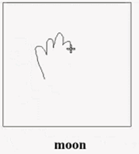

## Pictionary

This is a web demo for pictionary power by CNN(Convolution Neural Network), use caffe to train a googlenet on Human sketch database which come from [How Do Humans Sketch Objects](http://cybertron.cg.tu-berlin.de/eitz/projects/classifysketch/). Thanks for Mathias Eitz.




## Donwload Data Model

I share a pretained data model in this link https://pan.baidu.com/s/1hr2IYvq

Donwload this data model and move is in the data dirctory, then the repo looks like this:

```
├── data
│   ├── deploy.prototxt
│   ├── googlenet_iter_80000.caffemodel
│   └── sketch200.binaryproto
├── README.md
└── web
    ├── app.py
    ├── label.txt
    ├── predict.py
    ├── templates
    │   └── test.html
```


## How to use

The data model was train by Caffe, and the web app use the python warper of caffe (pycaffe), so you must install the pycaffe if you want run the web app in your computer.

After install pycaffe, you can run the web app

```
cd web
python app.py
```

Open `localhost:5000` in your bowser, then you can play pictionary.

**Attention!  To clear the canvas, just click the middle button of  your mouse.**


## Train yourself model

